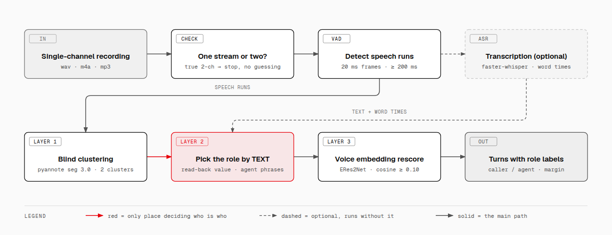
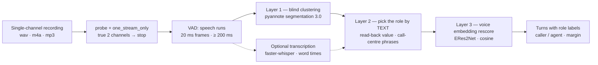

# monosplit

**Split the caller's voice from the agent's voice in a SINGLE-channel call recording.** Runs on
CPU, no PyTorch, two ONNX models totalling 44 MB.

## The problem

A two-channel recording needs no work: which channel is who is declared by the user. A
single-channel recording — the caller hitting record on a phone in the car, the call centre
exporting mono — puts both people in one waveform, and everything downstream (response-time
measurement, agent scoring, transcription) has to start with a guess: *who said this?* Guessing
wrong means blaming the agent for the caller's own words.

A file marked "stereo" is **no** guarantee that this has already been solved. Plenty of real
two-channel recordings are duplicated mono (both channels identical sample for sample), or one
side recorded while the other is silent. Trusting the channel count in the metadata and taking the
two-channel path with those files means every utterance is transcribed twice and assigned to both
roles with **the same timestamps** — a transcript that looks complete and means nothing.
`monosplit` measures the amplitude difference between the two channels first, and only then decides
which path to take; on a genuine two-channel recording it stops and tells you to use each channel
directly instead of guessing.

## The pipeline



<details>
<summary>Same diagram in mermaid (easier to edit in the repo; the PNG above is sharper, so it stays the main figure)</summary>



</details>

## The three layers

| Layer | What it does | Model | What it CANNOT do |
|---|---|---|---|
| **1. Blind clustering** | Splits the recording into two voice clusters, knows *there are two people* and *when the speaker changes* | pyannote segmentation 3.0 + ERes2Net, via `sherpa-onnx` (ONNX) | Does not know which cluster is who. Tends to swallow a short turn ("yes", "mhm") into the long turn next to it |
| **2. Pick the role by TEXT** | Decides which cluster is the agent: the side that reads back the value to be confirmed, the side that speaks the call-centre lines | No model — rules over the text from the ASR step | Without `faster-whisper` this layer has no evidence and must fall back to guessing from who spoke last. This is the **only** place where who-is-who is decided |
| **3. Voice embedding rescore** | Takes the longest piece of each cluster as an enrollment sample, compares the cosine of every VAD run, and pulls back to the right side the turns layer 1 swallowed | ERes2Net (3D-Speaker), a shortcut version of Target-Speaker VAD | When two voices are too similar (cosine less than 0.10 apart) it will not dare to correct: it keeps the layer-1 label and lowers confidence |

## Installation

Needs `ffmpeg` on `PATH` (decodes any format down to 16 kHz PCM).

```bash
git clone https://github.com/kagamikuro1024/mono-speaker-split
cd mono-speaker-split
uv sync --extra asr --extra web          # or: pip install -e ".[asr,web]"
```

Drop `--extra asr` and roles are still split, only the turns carry no text and layer 2 loses its
evidence. Drop `--extra web` if you do not need the interface.

The two ONNX models download themselves on the first run into `~/.cache/monosplit` (segmentation
6 MB, voice embedding 38 MB). If you already have them elsewhere, point at that directory:

```bash
export MONOSPLIT_MODELS=~/.cache/voice-diar   # directory holding seg.onnx and emb.onnx
```

## Usage

### Command line

```bash
monosplit cuoc-goi.wav                                   # print the turn table
monosplit cuoc-goi.wav --json                            # print Result.to_dict()
monosplit cuoc-goi.wav --no-asr                          # skip transcription
monosplit cuoc-goi.wav --models ~/.cache/voice-diar      # use models you already have
monosplit cuoc-goi.wav --requirement "license plate"     # value the agent must read back
monosplit cuoc-goi.wav --separator sepformer16k.onnx     # also recover the words inside overlaps
```

`--requirement` is layer 2's strongest evidence: declare the value the agent is obliged to repeat
for confirmation and picking the role no longer depends on stock phrases.

### Library

```python
from pathlib import Path
from monosplit import MonoSpeakerSplitter, ensure_models, separate

seg, emb = ensure_models()
result = separate(Path("cuoc-goi.wav"), MonoSpeakerSplitter(str(seg), str(emb)))
for turn in result.turns:
    print(f"{turn.start_ms:>7} {turn.speaker:<6} {turn.text}")

for span in result.overlaps:          # suspected both talking at once — inferred
    mark = " · separated" if span["separated"] else ""
    print(f"{span['start_ms']:>7} {span['who_cut_in']} cut in{mark}")
```

`separate` also takes `transcriber=Transcriber("small")` for text, `requirements=[...]` like
`--requirement`, and `voice_separator=VoiceSeparator("sepformer16k.onnx")` so that turns covering an
overlap are re-read off that role's recovery channel.
When it cannot split, it raises `SeparationError` with a `code` of
`khong_co_tieng_noi`, `khong_tach_nguoi_noi` or `hai_kenh_that` — a code so the caller can show the
right message, instead of an empty result that looks like a completed run.

### Web interface

```bash
uvicorn monosplit.web:app          # open http://127.0.0.1:8000
```

Drag a file onto the page to see the waveform and the role-labelled turns. API:
`POST /api/separate` (multipart `file`, optional `requirements`) returns `Result.to_dict()` along
with `waveform`.

## What this project does NOT do

- **Cannot measure total overlap seconds.** Two people speaking at once on one channel leave a
  single waveform — it cannot be pulled apart again. *Detecting* that there is overlap is doable
  (see the section below), but adding it up into a total duration is not: here it must report "not
  measurable", never 0.
- **Labels are inferred, not ground truth.** Every `Result` carries `role_reason` (which evidence
  layer 2 used to choose) and a per-turn `margin`. The weakest evidence — "guessed from whoever
  spoke last" — is stated outright so you can check it, not hidden to make the result look certain.
- **When the two voices are identical, only turn order is left.** Synthetic recordings often use
  the same TTS voice for both roles; voice embeddings are useless there. `monosplit` alternates
  labels turn by turn, sets `same_voice=True` and adds a warning — and does so only when the speech
  itself shows there are two roles, because "one voice" is also true of a recording with only one
  speaker.
- **Does not identify specific speakers.** There is no voice database, no knowing which agent is
  speaking. Agent voices change per user configuration, so they cannot be pinned down.
- **Not a transcription tool.** Transcription is an optional branch, present so layer 2 has text to
  pick the role with.

## Overlap detection: measurable, but only inferred

The segmentation model layer 1 uses is a **7-class powerset** — read straight out of the metadata
of `seg.onnx`:

```
num_classes = 7 · num_speakers = 3 · powerset_max_classes = 2
receptive_field_shift = 270   → 16.875 ms per frame
```

The 7 classes are `{∅, s1, s2, s3, s1s2, s1s3, s2s3}` — **the last three are two people speaking at
once** ([Plaquet & Bredin, arXiv:2310.13025](https://arxiv.org/abs/2310.13025)). The nice part:
overlap is an ordinary `argmax` class, with no threshold to tune.
`sherpa_onnx.OfflineSpeakerDiarization.process()` already returns segments that **overlap in time**,
so the information is there; it is `speakers.py::split_runs()` that cuts them into adjacent pieces —
necessary so each turn has exactly one label — and that is where the trace of "two people speaking
at once" gets erased.

### Measured on a set with ground truth

Mix a two-channel recording down to one channel, make the model work **only with the mixdown**, and
compare against ground truth taken from the two separate channels:

| Case | Ground truth (2 channels) | Model (mono mixdown) |
|---|---|---|
| 5 cases with no overlap | 0 s | **0 s — never a false alarm** |
| 1 case with 0.7 s overlap | 0.59 s at 4.49–5.16 s | 0.78 s at 4.42–5.20 s |

On the overlapping case: **recall 1.00** by frame, precision 0.76, F1 0.86. The start mark is off by
**60 ms** from the ground truth declared in the manifest, below the 150 ms error margin of the
sample set itself. The direction of the barge-in can also be inferred from the label sequence: the
cluster that enters later is the one cutting in, the cluster that leaves the overlap first is the one
yielding.

Cost: **0.9 seconds of processing per minute of audio** on CPU, with no extra model.

### Why it is still not presented as a measurement

Sensitivity on **real human voices over the phone** (two real voices mixed from two call-centre
recordings):

| Real overlap | Caught | Frame recall |
|---|---|---|
| 200 ms x 3 | 2/3 | 0.45 |
| 400 ms x 3 | 2/3 | 0.67 |
| 800 ms x 3 | 2/3 | 0.54 |
| 1500 ms x 3 | **3/3** | 0.69 |

This matches the published figures: the F1 of overlapped speech detection drops from ~75 on
head-mounted microphones (AMI) to **~60 on DIHARD III**, which contains a telephone-speech domain
([Bredin & Laurent, Interspeech 2021, Table 2](https://www.isca-archive.org/interspeech_2021/bredin21_interspeech.pdf)).
The weak spot is recall: short backchannels ("yes", "mhm" under 200 ms) — exactly the kind most
common in a call centre — are missed often. On top of that the boundaries are blurred by **±62 ms**
(receptive field 991 samples), so the total duration inflates by about **1.36x**.

So the line is: **overlap present / absent** and **the start mark** are measurable; **total seconds**
are not. Report the count and the marks, do not add them up into seconds.

### The "separate the waveforms, then measure" route: weighed, and rejected

Measuring overlap from two *separated* streams produces phantom overlap. Measured on exactly this
domain — two-party telephone speech, Fisher/CALLHOME, real overlap 13–14% —
[Morrone et al. 2024](https://arxiv.org/html/2303.12002v2) gives: a good separator (SI-SDRi ~22 dB)
**FA 2.6–4%**, a cheap separator (Conv-TasNet) **FA 31%** — larger than the quantity being measured;
even **perfect** (oracle) separation still gives FA 1.8%. On top of that: no TSE model has an
official ONNX build, Alibaba's ready-to-use pretrained model is **audio-visual** (needs face video),
and the MossFormer2 checkpoint weighs **670 MB** against the current 44 MB. Trading that away for a
number that is 20–40% wrong: no.

### Text in an overlapping stretch: every word belongs to exactly one turn

In a stretch where two people speak at once, the ASR hears only **one** word sequence — it does not
know it is hearing two people. That sequence has to be divided between two turns, and how it is
divided decides whether the transcript is readable.

The old approach let each turn widen itself by 400 ms on both ends and then scanned independently, so
a word in the boundary zone went into **both** turns. Not just duplicated text: the caller's turn
carried the value the agent had just read back, and anyone reading the transcript afterwards — human
or scoring model — believed the agent had repeated that number. Evidence for something that never
happened.

`words_per_piece()` assigns each word to the turn it **overlaps the most**. A word that overlaps no
turn (ASR timestamps drifted, or it falls into silence) only then goes to the nearest turn, and only
if it is within 400 ms — further than that it is dropped, because a careless assignment is worse than
a missing word.

Without a separator that is where it ends: a phrase inside the overlapping stretch is cut in two,
the first half going to one person and the second half to the other. With `--separator` the turns
covering that stretch are re-read and come out whole - see the next section.

## Recovering the words inside an overlap

Pass `--separator model.onnx` and every overlap of at least **400 ms** is separated into two
streams. Those streams are not reported on the side: they are spliced back into a **recovery channel
per role** - the mixture outside the overlap, that role's separated stream inside - and each turn is
re-read off the channel of the person who spoke it. The words land straight in the transcript, where
the user can correct them.

Same file, before and after, against a two-channel recording of the same call as ground truth:

```
#  Role    Start     End       Text
1  Caller  0:00.000  0:05.262  Gọi cho tôi số 0903456789. Nhớ nhắc lại số trước khi bấm gọi nhé.
2  Agent   0:05.245  0:08.160  -03 -456789, tôi gọi Lu Nga.          ← mixture: first words lost
2  Agent   0:04.452  0:08.160  Số 0903456789, tôi gọi luôn ạ.        ← recovery channel

Suspected overlap: 1 time(s) (inferred, not measured)
             4.5s — Agent cut in · voices separated to re-read the words
```

(Real output on Vietnamese call audio, kept verbatim - translating a measurement invents one. The
agent turn reads "Number 0903456789, calling now".)

Note the start time as well: **5.245 s → 4.452 s**, against 4.480 s in the two-channel recording.
Blind clustering cannot cut inside a stretch where both people speak, so it starts the interrupter's
turn *after* the overlap and their first words get counted into the other person's turn. When an
overlap is separated, that turn's start is pulled back to the start of the overlap, and the two
turns are then allowed to overlap in time - which is what talking over each other is.

Every separated stretch is flagged (`separated: true`, and the CLI line above), because this is
still inferred text: the place to listen before trusting it.

### What it costs, and which model

Measured on a 30-case suite built from two-channel sources, so every case has per-side ground truth;
scoring is CER against the known words, not SI-SDR:

| Model | Size | CER caller | CER agent | RTF |
|---|---|---|---|---|
| mixture, no separation | - | 0.68 | 0.67 | - |
| SepFormer wsj0-2mix 8 kHz int8 | 28.5 MB | 0.64 | 0.34 | 0.26 |
| MossFormer2 16 kHz | 639 MB | 0.56 | 0.53 | 6.4 |
| **SepFormer WHAMR 16 kHz** | 106 MB | **0.33** | **0.33** | 1.2 |

MossFormer2 has the best SI-SDRi of the group and still loses on words - which is the only thing
being measured here. The 8 kHz model throws away the band ASR needs. Read the delta, not the
absolute CER: the reference is the whole turn while the scoring window only covers the overlap, so
text outside the window counts as missing.

`python -m benchmark.overlap` on the same 26 ground-truth cases, all through the shipped code path:
caller CER **0.65 → 0.36**, agent CER **0.78 → 0.35**, better in **24 of 26** cases - 17/18 of the
synthetic-overlap group, 6/6 of the level-mismatch group. The one control case that got worse has no
overlap at all, which is the reason for the 400 ms floor below.

Model used: [`tonythethompson/SepFormer-WhamR16k-ONNX`](https://huggingface.co/tonythethompson/SepFormer-WhamR16k-ONNX),
an ONNX export of `speechbrain/sepformer-whamr16k`, Apache-2.0. Still no PyTorch in the path.

### Three limits wired into the code

- **Short overlaps are left alone.** LibriCSS ([arXiv:2001.11482](https://arxiv.org/abs/2001.11482))
  measured 0% overlap and found separation made WER *worse*: 11.8 → 12.7. The suite here agrees: at
  200 ms, 2 of 6 cases came out worse than not separating. Hence the 400 ms floor.
- **The text is still inferred, and says so.** Cascaded separation → ASR fails through *speaker
  leakage*: one person's words land in the other stream
  ([arXiv:2608.22196](https://arxiv.org/abs/2608.22196), Interspeech 2026, up to 71–77% WER on AMI),
  and Whisper can invent whole sentences on short clips
  ([arXiv:2402.08021](https://arxiv.org/abs/2402.08021)). The words do go into the transcript -
  that is the point of a transcript a user can edit - but every rebuilt stretch carries
  `separated: true` so the reader knows exactly where to listen first.
- **No channels at all rather than guessed roles.** The two streams leave the separator unnamed.
  Enrollment samples of each role decide which is which, scored as a pairing; below a 0.10 cosine
  margin nothing is built and the mixture is kept. One TTS voice reading both parts lands here by
  design: swapping the channels would swap both sides' words across the whole overlap, which is far
  worse than a mixture that merely loses some.

What the separator does not buy back is **timestamps inside the overlap**: turn boundaries still
come from the original waveform, and the interrupter's start is pulled to the overlap's own start,
which the segmentation model also only inferred (±62 ms).

## Thresholds that matter

Every number here is measured, and wherever it was measured on the sample set, the measured range is
written down in the source.

| Constant | Value | Where | Why this number |
|---|---|---|---|
| `SAME_STREAM_RATIO` | `0.02` | `audio.py` | Duplicated mono differs by 0.000–0.007% in amplitude; genuine two-channel differs by 180–196%. 2% sits in between and tolerates compression error |
| `SILENT_CHANNEL_RATIO` | `0.01` | `audio.py` | A channel smaller than 1% of the other carries nobody's speech |
| `VAD_FRAME_MS` / `MIN_SPEECH_MS` | `20` / `200` | `pipeline.py` | The same numbers as the two-channel path, so both paths produce the same timeline on the same recording |
| `MIN_PIECE_MS` | `300` | `speakers.py` | A 120 ms piece left after cutting on cluster boundaries is not a turn, it is filler — merge it back into the neighbouring piece |
| `MERGE_GAP_MS` | `400` | `speakers.py` | Two turns of the same cluster less than this apart are one turn |
| `MIN_ENROLL_MS` | `1000` | `speakers.py` | ERes2Net needs about a second of speech to produce a stable vector |
| `MIN_SAMPLE_MS` | `400` | `speakers.py` | If a cluster has no piece reaching a full second, still take the longest piece from this level up: a short sample beats switching layer 3 off entirely |
| `MIN_COSINE_MARGIN` | `0.10` | `speakers.py` | Below this the two voices are too close (or the run is too short): keep the layer-1 label, lower the confidence |
| `MAX_SAME_VOICE_COSINE` | `0.40` | `speakers.py` | Measured on the 30-case acceptance suite: same person 0.54–0.74, different people 0.06–0.27. 0.40 sits between the two ranges |
| `MIN_RESCUE_MS` | `180` | `speakers.py` | The turns that get swallowed are exactly "mhm", "yes" — shorter than the normal sampling floor, and dropping them leaves nothing to rescue |
| `MIN_OVERLAP_MS` | `150` | `speakers.py` | The model's boundaries are blurred by ±62 ms, so an overlap run shorter than this is debris of that same error rather than a real overlap |
| `MIN_SEPARATE_MS` | `400` | `separate_voices.py` | Below this, separating makes the words worse than leaving them: LibriCSS saw WER 11.8 → 12.7 at 0% overlap, and 2 of 6 cases at 200 ms in the suite here came out worse |
| `PAD_MS` | `1500` | `separate_voices.py` | Context on both sides of the overlap. Cut flush and the separator only ever hears the mixed part and folds both voices into one stream; 1.5 s scored best on the suite |
| `MIN_ASSIGN_MARGIN` | `0.10` | `separate_voices.py` | Same value as `MIN_COSINE_MARGIN`: two places assigning roles with two different thresholds would report two different answers for one recording |

## Benchmark

A suite that runs for real, no simulation: see [`benchmark/README.md`](benchmark/README.md).

```bash
python -m benchmark.run --audio /path/to/recordings   # prints a markdown table + writes benchmark/report.json
```

## Licence

MIT — see [`LICENSE`](LICENSE).

## Thanks

This project is just three layers of logic on top of other people's work:

- [sherpa-onnx](https://github.com/k2-fsa/sherpa-onnx) — runs both models on `onnxruntime`, no
  PyTorch needed.
- [pyannote segmentation 3.0](https://huggingface.co/pyannote/segmentation-3.0) — the speaker
  segmentation model (ONNX build by
  [csukuangfj](https://huggingface.co/csukuangfj/sherpa-onnx-pyannote-segmentation-3-0)).
- [3D-Speaker](https://github.com/modelscope/3D-Speaker) — the ERes2Net voice embedding.
- [faster-whisper](https://github.com/SYSTRAN/faster-whisper) — transcription with word-level
  timestamps.
- Layer 3 is a shortcut version of Target-Speaker VAD,
  [Medennikov et al. 2020](https://arxiv.org/abs/2005.07272).
