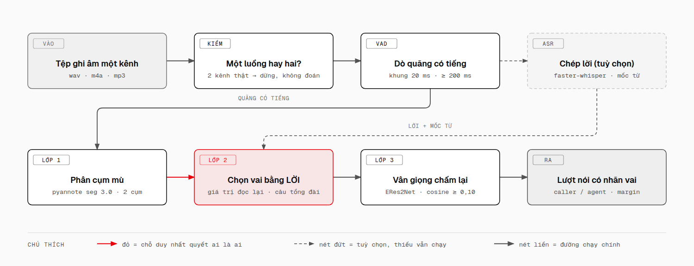
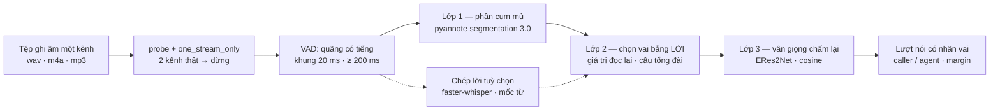

# monosplit

**Tách giọng khách và giọng agent ra khỏi một bản ghi cuộc gọi MỘT kênh.** Chạy trên CPU, không
PyTorch, hai mô hình ONNX cộng lại 44 MB.

## Vấn đề

Bản ghi hai kênh thì không có gì phải làm: kênh nào là ai do người dùng khai. Bản ghi một kênh —
khách bấm ghi âm trên điện thoại trong xe, tổng đài xuất mono — thì cả hai người nằm chung một
luồng sóng âm, và mọi thứ về sau (đo thời gian đáp, chấm điểm agent, gỡ băng) đều phải bắt đầu
bằng một câu suy đoán: *câu này ai nói?* Suy sai là chấm oan agent bằng chính lời của khách.

Tệp ghi "stereo" **không** đảm bảo điều đó đã được giải quyết. Rất nhiều bản ghi hai kênh thật ra
là mono nhân đôi (hai kênh giống nhau từng mẫu), hoặc thu một bên còn bên kia câm. Tin vào số kênh
trong metadata và đi đường hai kênh với những tệp đó thì mỗi câu bị phiên âm hai lần rồi gán cho
cả hai vai với **cùng một mốc thời gian** — một bản gỡ băng nhìn thì đầy đủ mà vô nghĩa. `monosplit`
đo chênh lệch biên độ giữa hai kênh trước, rồi mới quyết đi đường nào; gặp bản ghi hai kênh thật
thì nó dừng và bảo bạn dùng thẳng từng kênh chứ không đoán.

## Đường chạy



<details>
<summary>Cùng sơ đồ, dạng mermaid (dễ sửa trong repo; ảnh PNG ở trên rõ hơn nên để làm hình chính)</summary>



</details>

## Ba lớp

| Lớp | Làm gì | Mô hình | Cái nó KHÔNG làm được |
|---|---|---|---|
| **1. Phân cụm mù** | Chia bản ghi thành hai cụm giọng, biết *có hai người* và *đổi người lúc nào* | pyannote segmentation 3.0 + ERes2Net, qua `sherpa-onnx` (ONNX) | Không biết cụm nào là ai. Hay nuốt một lượt ngắn ("dạ", "ừ") vào lượt dài bên cạnh |
| **2. Chọn vai bằng LỜI** | Quyết cụm nào là agent: bên đọc lại giá trị cần xác nhận, bên nói câu của tổng đài | Không mô hình — luật trên chữ của bước ASR | Không cài `faster-whisper` thì lớp này mất căn cứ, phải rơi về đoán theo lượt cuối. Đây là chỗ **duy nhất** quyết ai là ai |
| **3. Vân giọng chấm lại** | Lấy đoạn dài nhất mỗi cụm làm mẫu, so cosine từng quãng VAD, kéo về đúng bên những lượt lớp 1 đã nuốt | ERes2Net (3D-Speaker), lối rút gọn của Target-Speaker VAD | Hai giọng quá giống nhau (cosine cách nhau < 0,10) thì không dám sửa: giữ nhãn lớp 1 và hạ độ tin cậy |

## Cài đặt

Cần `ffmpeg` trong `PATH` (giải mã mọi định dạng về PCM 16 kHz).

```bash
git clone https://github.com/kagamikuro1024/mono-speaker-split
cd mono-speaker-split
uv sync --extra asr --extra web          # hoặc: pip install -e ".[asr,web]"
```

Bỏ `--extra asr` thì vẫn tách được vai, chỉ là lượt không có chữ và lớp 2 mất căn cứ.
Bỏ `--extra web` nếu không cần giao diện.

Hai mô hình ONNX tự tải lần chạy đầu về `~/.cache/monosplit` (segmentation 6 MB, vân giọng 38 MB).
Đã có sẵn ở chỗ khác thì trỏ vào đó:

```bash
export MONOSPLIT_MODELS=~/.cache/voice-diar   # thư mục chứa seg.onnx và emb.onnx
```

## Dùng

### Dòng lệnh

```bash
monosplit cuoc-goi.wav                                   # in bảng lượt nói
monosplit cuoc-goi.wav --json                            # in Result.to_dict()
monosplit cuoc-goi.wav --no-asr                          # bỏ bước chép lời
monosplit cuoc-goi.wav --models ~/.cache/voice-diar      # dùng mô hình có sẵn
monosplit cuoc-goi.wav --requirement "biển số xe"        # giá trị agent phải đọc lại
```

`--requirement` là căn cứ mạnh nhất của lớp 2: khai giá trị mà agent buộc phải nhắc lại để xác
nhận thì việc chọn vai không còn phải dựa vào câu cửa miệng.

### Thư viện

```python
from pathlib import Path
from monosplit import MonoSpeakerSplitter, ensure_models, separate

seg, emb = ensure_models()
result = separate(Path("cuoc-goi.wav"), MonoSpeakerSplitter(str(seg), str(emb)))
for turn in result.turns:
    print(f"{turn.start_ms:>7} {turn.speaker:<6} {turn.text}")
```

`separate` nhận thêm `transcriber=Transcriber("small")` để có chữ, và `requirements=[...]` như
`--requirement`. Không tách được thì nó ném `SeparationError` với `code` là
`khong_co_tieng_noi`, `khong_tach_nguoi_noi` hoặc `hai_kenh_that` — mã để phía gọi hiện đúng câu,
chứ không phải một kết quả rỗng trông như đã chạy xong.

### Giao diện web

```bash
uvicorn monosplit.web:app          # mở http://127.0.0.1:8000
```

Kéo tệp vào trang để xem dạng sóng và các lượt đã gán vai. API: `POST /api/separate`
(multipart `file`, tuỳ chọn `requirements`) trả về `Result.to_dict()` kèm `waveform`.

## Điều dự án này KHÔNG làm

- **Không đo nói chồng / cướp lời.** Hai người cùng nói trên một kênh thì chỉ còn một luồng sóng
  âm — không có cách nào tách ra. Chỗ này phải báo "chưa đo được", không được báo 0.
- **Nhãn là suy đoán, không phải sự thật.** Mọi `Result` mang theo `role_reason` (lớp 2 đã chọn
  bằng căn cứ nào) và `margin` từng lượt. Căn cứ yếu nhất — "đoán theo bên nói lượt cuối" — được
  nói thẳng ra để bạn soát lại, chứ không ẩn đi cho kết quả trông chắc chắn.
- **Hai giọng giống nhau thì chỉ còn thứ tự lượt.** Bản ghi tổng hợp hay dùng cùng một giọng TTS
  cho cả hai vai; vân giọng khi đó vô dụng. `monosplit` gán nhãn luân phiên theo lượt, đặt
  `same_voice=True` và thêm cảnh báo — và chỉ làm vậy khi chính lời nói cho thấy có hai vai, vì
  "một giọng" cũng đúng với bản ghi chỉ có một người nói.
- **Không nhận diện người nói cụ thể.** Không có cơ sở dữ liệu giọng, không biết agent nào đang
  nói. Giọng agent đổi theo cấu hình của từng người dùng nên không ghim được.
- **Không phải bộ gỡ băng.** Chép lời là nhánh tuỳ chọn, có mặt để lớp 2 có chữ mà chọn vai.

## Ngưỡng quan trọng

Con số nào cũng đo được, và chỗ nào đo trên bộ mẫu thì ghi luôn khoảng đo trong mã nguồn.

| Hằng | Giá trị | Ở đâu | Vì sao con số này |
|---|---|---|---|
| `SAME_STREAM_RATIO` | `0.02` | `audio.py` | Mono nhân đôi lệch 0,000–0,007% biên độ; hai kênh thật lệch 180–196%. 2% nằm giữa và chịu được sai số nén |
| `SILENT_CHANNEL_RATIO` | `0.01` | `audio.py` | Một kênh nhỏ hơn 1% kênh kia thì nó không mang lời của ai |
| `VAD_FRAME_MS` / `MIN_SPEECH_MS` | `20` / `200` | `pipeline.py` | Cùng bộ số với đường hai kênh, để hai đường cho ra cùng một dòng thời gian trên cùng một bản ghi |
| `MIN_PIECE_MS` | `300` | `speakers.py` | Mảnh 120 ms sau khi cắt theo ranh giới cụm không phải một lượt nói, nó là tiếng đệm — nhập lại vào mảnh bên cạnh |
| `MERGE_GAP_MS` | `400` | `speakers.py` | Hai lượt cùng cụm cách nhau dưới mức này là một lượt |
| `MIN_ENROLL_MS` | `1000` | `speakers.py` | ERes2Net cần chừng một giây tiếng nói mới ra vector ổn định |
| `MIN_SAMPLE_MS` | `400` | `speakers.py` | Cụm không có mảnh nào đủ một giây thì vẫn lấy mảnh dài nhất từ mức này lên: mẫu ngắn còn hơn tắt hẳn lớp 3 |
| `MIN_COSINE_MARGIN` | `0.10` | `speakers.py` | Dưới mức này là hai giọng quá sát (hoặc quãng quá ngắn): giữ nhãn lớp 1, hạ độ tin cậy |
| `MAX_SAME_VOICE_COSINE` | `0.40` | `speakers.py` | Đo trên bộ nghiệm thu 30 ca: cùng người 0,54–0,74, khác người 0,06–0,27. Lấy 0,40 vào giữa hai khoảng |
| `MIN_RESCUE_MS` | `180` | `speakers.py` | Lượt hay bị nuốt đúng là "ừ", "dạ" — ngắn hơn mức lấy mẫu bình thường, bỏ nó thì không còn gì để cứu |

## Benchmark

Bộ chạy thật, không mô phỏng: xem [`benchmark/README.md`](benchmark/README.md).

```bash
python -m benchmark.run --audio /đường/dẫn/tới/bản-ghi   # in bảng markdown + ghi benchmark/report.json
```

## Giấy phép

MIT — xem [`LICENSE`](LICENSE).

## Cảm ơn

Dự án này chỉ là ba lớp logic đặt lên công trình của người khác:

- [sherpa-onnx](https://github.com/k2-fsa/sherpa-onnx) — chạy cả hai mô hình trên `onnxruntime`,
  không cần PyTorch.
- [pyannote segmentation 3.0](https://huggingface.co/pyannote/segmentation-3.0) — mô hình phân
  đoạn người nói (bản ONNX của
  [csukuangfj](https://huggingface.co/csukuangfj/sherpa-onnx-pyannote-segmentation-3-0)).
- [3D-Speaker](https://github.com/modelscope/3D-Speaker) — vân giọng ERes2Net.
- [faster-whisper](https://github.com/SYSTRAN/faster-whisper) — chép lời với mốc theo từ.
- Lớp 3 là lối rút gọn của Target-Speaker VAD,
  [Medennikov et al. 2020](https://arxiv.org/abs/2005.07272).
